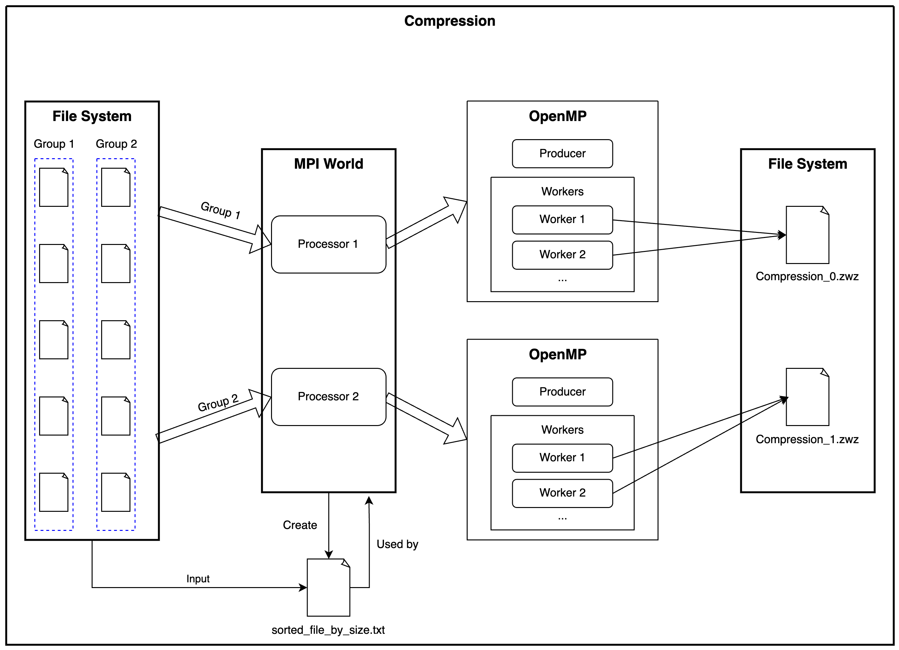
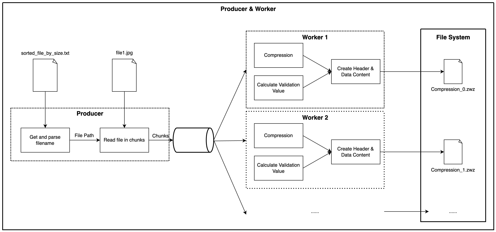
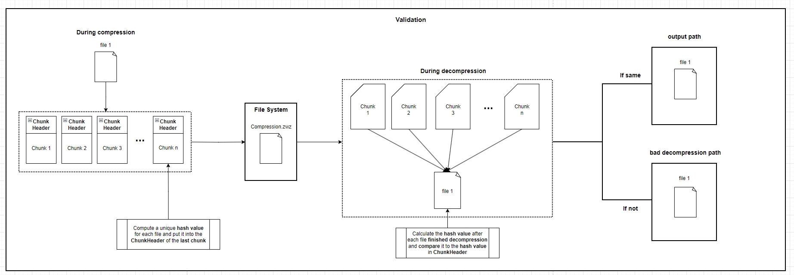
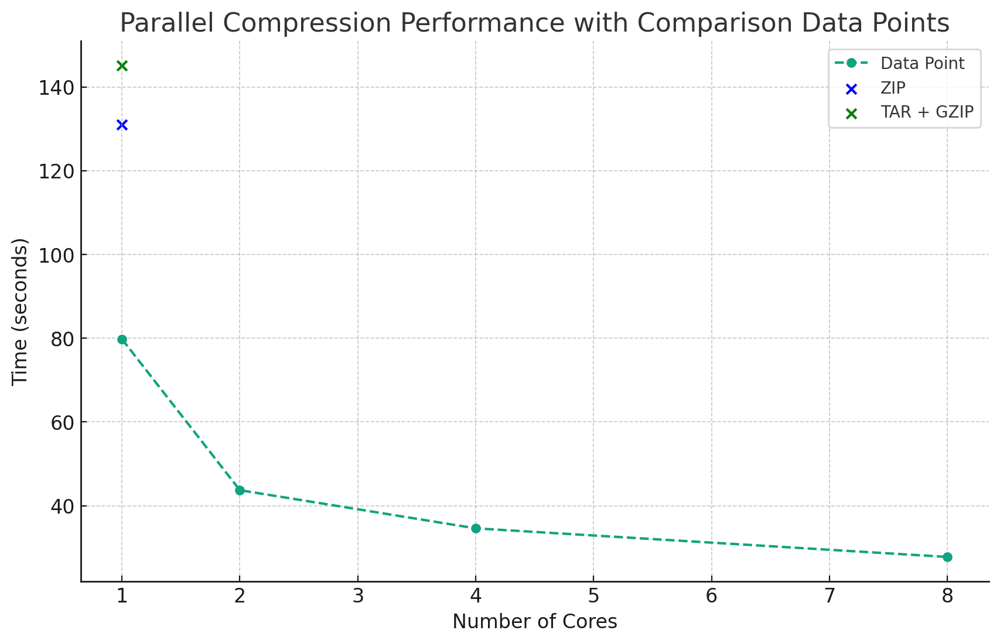

# Parallel Directory Compression and Decompression

## Authors
- Yaowen Zheng - USC Computer Science
- Yuhui Wu - USC Computer Science
- Mianzhi Zhu - USC Computer Science

## Introduction
In the rapidly evolving fields of computer and data science, an increasing number of ultra-large datasets are emerging. 
Traditional compression and decompression tools like zip and gzip, due to their single-threaded nature, often prove 
time-consuming for these datasets. For instance, compressing a dataset of approximately 370,000 images, totaling around 
2.5GB, takes over two minutes on an M1 MacBook when using system-provided zip software. This timeframe becomes impractical for 
larger datasets, which are becoming more common. Thus, leveraging parallel computing technology to expedite the compression and decompression 
process is essential. So, we chose "Parallel Directory Compression and Decompression" as our CSCI596 final project, which addresses this need.

This project focuses on **parallelizing** the compression and decompression processes for **large datasets**. 
We use **C** language combined with computing libraries like **Open MPI** (Message Passing Interface) and **OpenMP** to 
implement parallel compression and decompression based on sharding technology. For more details on the implementation 
architecture, please refer to the [Implementation](#implementation) section.

## Run Instructions

### Dependencies
- `MPI`
- `OpenMP`
- `zlib`
- `OpenSSL/MD5`

### MacOS - Arm
**0. Prerequisites**

Ensure Homebrew is installed on your system. If not, please follow the instructions on the [Homebrew](https://brew.sh/) website.

**1. Install Necessary Dependencies**

```shell
brew install gcc openmp libomp openssl@3
```

**2. Compile the Program**
```
mpicc -fopenmp \
    -I/opt/homebrew/opt/openssl@3/include \
    -L/opt/homebrew/opt/openssl@3/lib \
    main.c \
    file_process/file_sort.c \
    compression.c \
    file_process/file_tools.c \
    decompression.c \
    verification.c \
    hashmap.c \
    -o main \
    -lz -lssl -lcrypto -Wno-deprecated-declarations
```

**3. Run the Compression Program**
```
mpirun -n 2 main compress <source_directory> <output_directory>
```
- Use `compress` to do compression.
- `-n 2` specifies the number of processes. 
- `source_directory`: Directory containing the files to be compressed.
- `output_directory`: Directory where the compressed .zwz files will be saved.

**4. Run the Decompression Program**
```
mpirun -n 1 main decompress <source_directory> <output_directory>
```
- Use `decompress` to do decompression.
- `source_directory`: Directory containing the .zwz file 
- `output_directory`: Directory where the decompressed files will be saved
- Decompression only requires **1** MPI process and uses OpenMP to parallelize the decompression process.

**5. Execution Examples**
```
mpirun -n 2 main compress /tmp/Cache/temp/data /tmp/Cache/temp/output
mpirun -n 1 main decompress /tmp/Cache/temp/output /tmp/Cache/temp/output2
```

### MacOS Troubleshooting
**MacOS Compatibility with GCC and OpenMP**

If you encounter compatibility issues when compiling the program or any other OpenMP program, please install LLVM's Clang and configure the path:

**Install LLVM:**
```
brew install llvm
```
**Configure zsh/bash**
```
export PATH="/opt/homebrew/opt/llvm/bin:$PATH"
export OMPI_CC=clang
```

### Linux/Ubuntu/Debian
**0. Prerequisites**

Install sudo on your Linux/Ubuntu/Debian
```shell
apt install sudo
```
**1. Install Necessary Dependencies**

```shell
sudo apt install mpich
sudo apt install zlib1g-dev
sudo apt install openssl -y or sudo apt-get install libssl-dev
```

**2. Compile the Program**
```
mpicc -fopenmp file_process/file_sort.c main.c compression.c hashmap.c file_process/file_tools.c decompression.c verification.c -o main -lz -lcrypto
```

### IDE Function Suggestions/Resolving Header File Not Found Issues
Modify your dependency paths in `CMakeLists.txt`. Please ensure this file is not committed to your git repository.


## Implementation
In this project, we primarily utilized C, MPI, and OpenMP, implementing three main functionalities: compression, decompression, and verification.

### Compression

STEP 1: Read all files in the source directory, sort them in descending order by size, and save the result to a local text file (sorted_file_by_size.txt).

STEP 2: Use **MPI** to distribute files to different cores, with each core responsible for compressing a portion of the files.
This distribution strategy is similar to the PI calculation in the course, where files are assigned to different cores in sequence.
For example, with two cores, the first core compresses the 1st, 3rd, 5th, 7th, 9th... files, while the second core compresses the 2nd, 4th, 6th, 8th, 10th... files.
This strategy helps balance the compression load across different cores.


STEP 3: Implement parallelism using **OpenMP** by designing the compression process as a **producer-consumer model**. The producer runs in a single thread, responsible for reading files and placing file chunks into the processing queue. The consumer runs in multiple threads, taking file chunks from the queue for compression and writing them to the output stream.


### Decompression

STEP 1: Use OpenMP's multithreading to parallel assign different file segments to various decompression threads.

STEP 2: Process involves reading a fixed-length header from the stream, extracting the corresponding file chunk based on the header information.

STEP 3: Decompress the file chunk and write the decompressed content to the output stream.


### Verification

STEP 1: Add verification information (MD5 hash value) for each file chunk to the header during the compression process, calculated from the file content.

STEP 2: After decompression, calculate the verification information from the decompressed content and compare it with the header's verification information. If there's a mismatch, indicating file corruption, the file will be moved to an error folder; otherwise, it will be moved to the correct folder.


## Benchmark
### Compression

### Decompression

## Contributions
- Yaowen Zheng: Software workflow design, starter code, file compression, benchmarking, Readme Doc.
- Yuhui Wu: File decompression.
- Mianzhi Zhu: File verification, Readme Doc.

