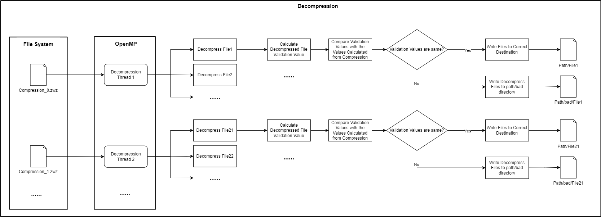

# Parallel Directory Compression and Decompression

## Authors
- Yaowen Zheng - USC Computer Science
- Yuhui Wu - USC Computer Science
- Mianzhi Zhu - USC Computer Science

## Introduction
This project focuses on the compression and decompression of large datasets and enables parallel computing across multiple nodes of a single disk system using MPI and OpenMP.

## Run Instructions

### Dependencies
- MPI
- OpenMP
- zlib

For MacOS, these can be installed using Homebrew. On Linux, they are available through package managers like apt-get.

### IDE Function Suggestions/Resolving Header File Not Found Issues
Modify your dependency paths in `CMakeLists.txt`. Please ensure this file is not committed to your git repository.

### Compilation - Example
```
mpicc -fopenmp file_process/file_sort.c main.c compression.c file_process/file_tools.c decompression.c -o main -lz
```
### Execution - Example
```
mpirun -n 2 main compress /tmp/Cache/temp/data /tmp/Cache/temp/output
mpirun -n 1 main decompress /tmp/Cache/temp/output /tmp/Cache/temp/output2
```


## Implementation
In this project, we primarily utilized C, MPI, and OpenMP, implementing three main functionalities: compression, decompression, and verification.

### Compression

STEP 1: Read all files in the source directory, sort them in descending order by size, and save the result to a local text file (sorted_file_by_size.txt).

STEP 2: Use **MPI** to distribute files to different cores, with each core responsible for compressing a portion of the files.
This distribution strategy is similar to the PI calculation in the course, where files are assigned to different cores in sequence.
For example, with two cores, the first core compresses the 1st, 3rd, 5th, 7th, 9th... files, while the second core compresses the 2nd, 4th, 6th, 8th, 10th... files.
This strategy helps balance the compression load across different cores.


STEP 3: Implement parallelism using **OpenMP** by designing the compression process as a **producer-consumer model**. The producer runs in a single thread, responsible for reading files and placing file chunks into the processing queue. The consumer runs in multiple threads, taking file chunks from the queue for compression and writing them to the output stream.


### Decompression

STEP 1: Use OpenMP's multithreading to parallel assign different file segments to various decompression threads.

STEP 2: Process involves reading a fixed-length header from the stream, extracting the corresponding file chunk based on the header information.

STEP 3: Decompress the file chunk and write the decompressed content to the output stream.


### Verification

STEP 1: Add verification information for each file chunk to the header during the compression process, calculated from the file content.

STEP 2: After decompression, calculate the verification information from the decompressed content and compare it with the header's verification information. If there's a mismatch, indicating file corruption, the file will be moved to an error folder; otherwise, it will be moved to the correct folder.


## Benchmarking

## Contributions
- Yaowen Zheng: Software workflow design, starter code, file compression, benchmarking.
- Yuhui Wu: File decompression, benchmarking.
- Mianzhi Zhu: File verification, benchmarking.

